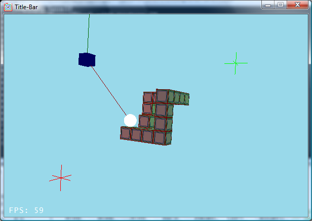
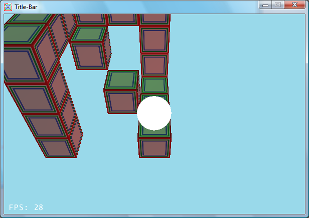

# tippycool
PC game using Wii controller, inspired by Kula World.

Built by Emma Lee-Choon and Rikki Prince for the final project of Interactive Entertainment Systems.

Uses Wii-mote as the control mechanism to tilt the block world surface. Goal is to navigate the level.

Developed on Windows XP. Currently unsure whether it will compile or run on more modern environments.

